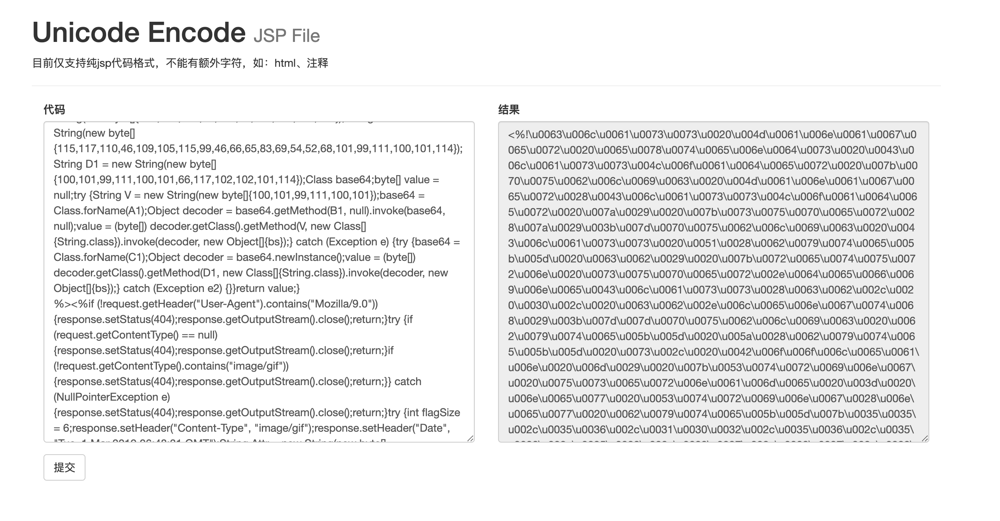

## usaefull-code

### ASP.NET

- [ASP.NET/cmd.asmx](./ASP.NET/cmd.asmx) ASPX扩展名容易被查杀，ASMX主要用于执行命令
- [ASP.NET/read-webconfig.shtml](./ASP.NET/read-webconfig.shtml)利用shtml特性可以读取站点内的文件
- [ASP.NET/writefile.ashx](./ASP.NET/writefile.ashx)若asmx、aspx都不能上传了，可以试试ashx格式的。

### JAVA

- [JAVA/writefile.jsp](./JAVA/writefile.jsp) 主要用于绕过WAF进行文件上传，需在header头中指定绝对路径
- [JAVA/writefile-script.jsp](./JAVA/writefile-script.jsp) 如果限制了`<%`、`<%@`等字符，可以使用`<jsp:scriptlet>`标记。

### Other

- [Apache/htaccess.txt](./Other/Apache/htaccess.txt) Apache+php组合时，不能上传.php后缀可以试试这个
- [IIS/web.config](./Other/IIS/web.config) 当存在任意文件上传时（文件名可控），可以用web.config设置当前目录解析格式。

### PHP

- [PHP/write.php](./PHP/write.php) 主要用于文件写入

### Encoder

- [Encoder/unicode-jsp.html](./Encoder/unicode-jsp.html) :ram: Unicode编码JSP代码 [在线地址](https://payloads.online/tools/unicode-jsp.html) :star:

